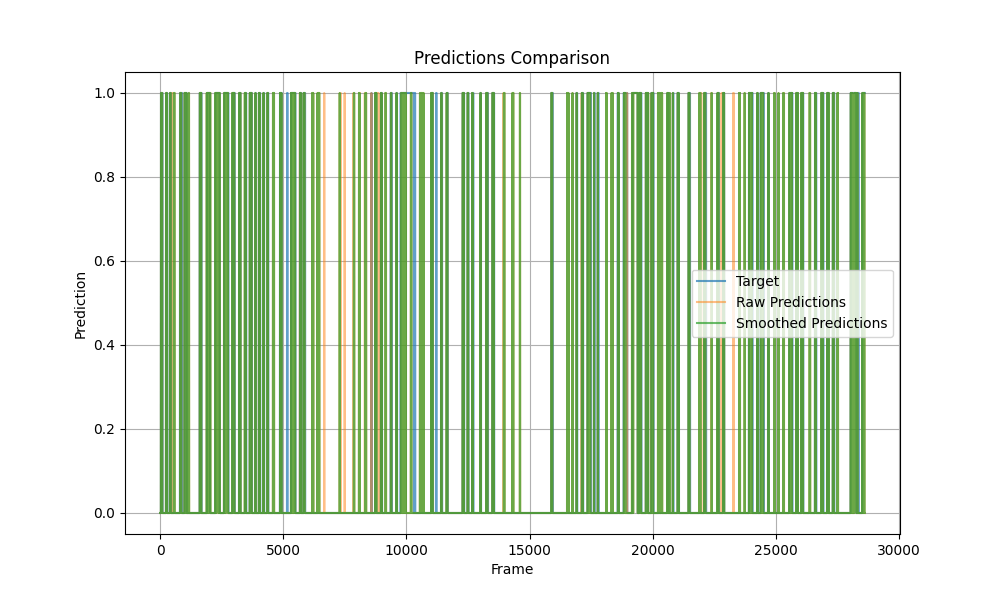

# Automated Highlight Generation System for Volleyball

---

## Output Highlights

Watch the final volleyball match highlights, featuring smooth transitions and key moments:  
[](https://youtu.be/YOugo51-bzQ)

---

## Overview
The **Automated Highlight Generation System for Volleyball** is an advanced system designed to automatically detect and generate highlights from volleyball match videos. It leverages machine learning techniques for trajectory analysis, along with advanced video processing to create smooth transitions between key moments in the game. This system is useful for coaches, analysts, and sports media companies looking for efficient ways to summarize games and create engaging video content.

---

## Table of Contents
1. [Project Phases](#project-phases)
2. [Features](#features)
3. [Installation](#installation)
4. [Usage](#usage)
5. [File Structure](#file-structure)
6. [Model Details](#model-details)
7. [Video Transition](#video-transition)
8. [Results](#results)
9. [Evaluation and Metrics](#evaluation-and-metrics)
10. [Acknowledgments](#acknowledgments)

---

## Project Phases

The project is divided into several key phases, each focusing on different aspects of video analysis and highlight generation:

1. **Introduction and Data Exploration**: Exploration of match data and video frames to understand the key features for highlight detection.
2. **Data Collection and Preprocessing**: Data from volleyball matches is collected, cleaned, and preprocessed to handle missing values and normalize features.
3. **Feature Engineering**: Additional features such as ball size, aspect ratio, and time-lagged features are created for better model performance.
4. **Model Development**: An SVM (Support Vector Machine) classifier is used for classifying key events in the game, based on the engineered features.
5. **Video Processing**: The system processes video frames to extract relevant moments, with smoothing applied to predictions to enhance the stability of detected events.
6. **Highlight Generation**: The system automatically generates video highlights based on model predictions.
7. **Refinement and Storytelling**: Generated highlights are further refined to ensure smooth transitions and contextually meaningful results.
8. **Final Presentation**: The final highlights are presented with video transitions, making it easy to view and share key moments from the match.

---

## Features
- **Trajectory Analysis**: Uses trajectory data of the ball to detect key events and moments.
- **Machine Learning Classification**: SVM classifier for event classification based on engineered features like aspect ratio and ball size, optimized using hyperparameter search for C, gamma, and kernel.
- **Smoothing of Predictions**: Applies advanced smoothing techniques such as moving average, median, and Gaussian filters, along with frame expansion, to reduce noise in predictions.
- **Video Transition Effects**: High-quality transition effects like fade, wipe (left and right), dissolve, and motion-aware blending between video frames for a polished and professional final output.
- **Real-Time Video Processing**: Efficient video reading, processing, and writing for highlight generation.
- **Customizable Parameters**:  Users can tweak parameters such as transition types, window size, and video output format for greater flexibility.

---

## Installation

### Requirements

Before running the project, ensure that you have the following dependencies installed:

- Python 3.9.18 (Project tested on this version)
- All required dependencies listed in the `requirements.txt` file

### Steps to Install

1. Clone the repository:
   ```bash
   git clone https://github.com/vikasrkarjigi/Automated-Sports-Content-Generation.git
   cd automated-highlight-generation
   ```

2. Create and activate a virtual environment:
   ```bash
   python -m venv venv
   source venv/bin/activate  # On Windows: venv\Scripts\activate
   ```

3. Install the required libraries:
   ```bash
   pip install -r requirements.txt
   ```

4. Ensure that the video files and data files are correctly placed in the `data` folder.

---

## Usage

### 1. Preprocessing and Model Training

- **Data Analysis and Visualization**: Clean the data and visualize plots (histogram, scatter, boxplot, etc.) using `data_analysis_Initial.py`:
    ```bash
    python data_preprocessing/data_analysis_Initial.py
    ```

- **Custom Feature Engineering**: Add custom derivative features such as "time spent in region" with `data_analysis_custom_feature.py`:
    ```bash
    python data_preprocessing/data_analysis_custom_feature.py
    ```

- **Feature Visualization**: Visualize the custom features with ball tracking in a video using `animation.py`:
    ```bash
    python data_preprocessing/animation.py
    ```
  
### 2. Train the Model

- **Train & Test**: Train the SVM model on preprocessed data and test on 30% of the remaining data. Visualize predictions using:
    ```bash
    python model_training/time_classification.py
    python .\model_training\visualize_target.py .\data\tracking_visualization.mp4 .\model_training\results\predictions_svm.csv --output .\model_training\results\prediction_svm_video.mp4  
    ```
- **Enhance Performance**: Add feature engineering (aspect ratio, size) and perform hyperparameter tuning (C, gamma, kernel) for improved accuracy. Visualize the results:
    ```bash
    python model_training/time_classification_hyperparameter.py
    python .\model_training\visualize_target.py .\data\tracking_visualization.mp4 .\model_training\results\predictions_svm_hyperparameter.csv --output .\model_training\results\prediction_svm_hyperparameter_video.mp4  
    ```

### 3. Smoothed Predictions:
   - Apply advanced smoothing techniques to reduce noise in the predictions:
     ```bash
     python  .\video_processing\filter_predictions.py
     ```

### 4. Highlight Generation:
   - Once the model is trained, run the highlight generation script to create the highlights from a video:
     ```bash
     python  .\video_processing\opencv_intro.py .\model_training\results\prediction_svm_hyperparameter_video.mp4 --csv .\video_processing\results\smoothed_predictions.csv --filters --crop 10 10 80 80
     ```

### 5. Video Transition:
   - Apply transitions between key moments in the video:
     ```bash
     python .\video_processing\video_transition.py
     ```


---

## File Structure

```
Automated-Highlight-Generation/
│
├── data/                         # Contains raw data and videos
│   ├── tracking_visualization.mp4    # Input video file
│   ├── provided_data.csv         # Raw trajectory data
│   └── target.csv                # Classification target data
│
├── data_preprocessing/           # Data collection and preprocessing
│   ├── data_analysis_initial.py   # Initial data cleaning and visualization
│   ├── data_analysis_custom_feature.py  # Adding custom features
│   ├── animation.py              # Visualize custom features with ball tracking
│   ├── results/                  # Results generated by data preprocessing scripts
│
├── model_training/               # Model selection and training
│   ├── time_classification.py        # Train SVM classifier
│   ├── time_classification_hyperparameter.py  # Hyperparameter tuning and model refinement
│   ├── visualize_target.py           # Visualize model predictions on video
│   ├── results/                      # Results generated by model training scripts
│
├── video_processing/             # Video smoothing and transitions
│   ├── filter_predictions.py        # Apply advanced filtering techniques
│   ├── opencv_intro.py              # Highlight generation with OpenCV
│   ├── video_transition.py          # Apply transitions between video segments
│   ├── results/                     # Results generated by video processing scripts
│
├── results/                      # General output files
│   ├── smoothed_predictions.csv  # Smoothed model predictions
│   ├── transition.mp4            # Video with transitions
│   └── output_video.mp4          # Video without transitions
│
└── requirements.txt              # Project dependencies

```

---

## Model Details

The model used for classifying key events is a **Support Vector Machine (SVM)**. The following steps were taken to train the model:

1. **Feature Engineering**: 
   - Created time-lagged features and derived features like `aspect_ratio` and `size` to represent the ball's movement and characteristics.

2. **Model Training**: 
   - Hyperparameters for the SVM were tuned using a grid search on parameters like `C`, `gamma`, and `kernel` type.

3. **Validation Strategy**: 
   - A chronological split was used for validation to ensure the model respects the temporal nature of the data.

---

## Video Transition

The `video_transition.py` script generates smooth transitions between key frames in the video using the following effects:

- **Fade**: Gradual blending between two frames.
- **Wipe**: A horizontal wipe from left to right or right to left.
- **Dissolve**: A dissolve effect where pixels randomly switch between two frames.
- **Motion Blend**: Dynamic blending based on motion detected via optical flow.


These transitions are useful for creating professional-looking highlight reels that maintain viewer engagement.


---

## Results

The **Automated Highlight Generation System for Volleyball** successfully generated meaningful highlights from volleyball match videos. Here are the key results:

1. **Model Performance**:
    - The SVM classifier was trained and validated using multiple feature sets, achieving impressive classification accuracy. Through hyperparameter optimization, the model's weighted F1 score was significantly improved, making it more effective and reliable in detecting key events during the game. The **weighted F1 score increased to 88%**, demonstrating the success of the optimization process. Below is the result from the classification report.
     <div style="margin-top: 20px; display: flex; justify-content: center; gap: 20px; margin-bottom: 20px">
        
        
     </div>

2. **Smoothing of Predictions**:
   - Applies advanced smoothing techniques such as moving average, median, and Gaussian filters, along with frame expansion, to reduce noise in predictions and enhance the reliability of key event detection. 
   - The PredictionSmoother class optimizes parameters like window size, filter type, and expansion size for the best smoothing performance. The final smoothed predictions are saved in smoothed_predictions.csv, improving the model's output quality.
   - A comparison plot between raw and smoothed predictions was also generated, showcasing the stability improvement. This plot is shown below:
   
    <div style="margin-top: 20px; display: flex; justify-content: center; gap: 20px; margin-bottom: 20px">
        
    </div>
   
3. **Video Highlights**:
   - The video highlight generation process successfully identified key moments from the model's predictions and highlighted them in the **output_video.mp4** file. Appropriate video transitions (fade, wipe, dissolve, and motion blend) were applied to ensure a smooth flow of highlights. Below is the output after applying the filters and smoothing.

    <div style="margin-top: 20px; display: flex; justify-content: center; gap: 20px; margin-bottom: 20px">
        
    </div>

4. **Video Transition Effects**:
   - The video transitions were visually appealing, adding a professional touch to the highlight reel. The transitions were applied to the frames between the key moments, enhancing the viewing experience.


5. **Final Output**:
   - The final video, **enhanced_transition_full_video.mp4**, consists of highlights with smooth transitions, ready for presentation or sharing with audiences. This video showcases the model's ability to generate dynamic, engaging highlight clips with high-quality video transitions.
    [Watch the Full Video Highlight on YouTube](https://youtu.be/YOugo51-bzQ)
---

## Evaluation and Metrics

The model was evaluated using the following metrics:

- **Precision**: Measures the accuracy of the positive predictions.
- **Recall**: Measures the ability of the model to find all relevant instances.
- **F1-Score**: Harmonic mean of precision and recall.
- **ROC-AUC**: Measures the trade-off between true positive rate and false positive rate.

Additionally, the video transitions are evaluated based on visual smoothness and aesthetic quality.

---

## Acknowledgments

- OpenCV for video processing.
- Scikit-learn for machine learning and model evaluation.
- NumPy for numerical computations.
- Pandas for data manipulation.
